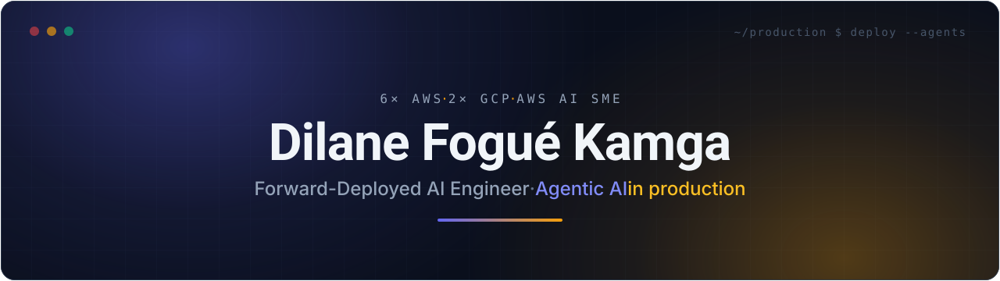
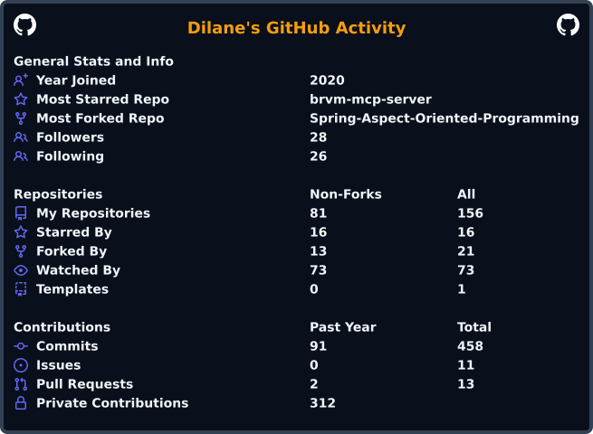

<!-- Profile README — Dilane Fogué Kamga. Banner lives in assets/banner.svg (self-contained, no external service). -->

  

  

  
  
  

## About

**Forward-Deployed AI Engineer @ Accenture**, embedded in a Fortune-100 financial-services client. I ship agentic AI into production for regulated finance — and get the organization to actually adopt it.

- 🧠 Building production agentic systems (**Bedrock**, **Claude**, **Google ADK**, **LangGraph**, **MCP**) on event-driven **Java / Kafka** backbones
- 📈 **MSc Financial Engineering** (WorldQuant) — working at the intersection of quant finance and AI
- ☁️ **6× AWS · 2× GCP** · **AWS AI Subject-Matter Expert** (I help author AWS AI certification exams)
- ✍️ I write **Agentic AI Hebdo** — what actually breaks when you ship agents
- 🌍 From **Bandjoun, Cameroon** → building in **Mauritius**. Bilingual FR / EN.

## Tech stack

**Languages** &nbsp;&nbsp;    

**Backend & streaming** &nbsp;&nbsp;    

**AI / agentic** &nbsp;&nbsp;      

**Cloud & DevOps** &nbsp;&nbsp;      

**Data / databases** &nbsp;&nbsp;     

## Featured projects

| Project | What it does | Stack |
|---|---|---|
| [`brvm-mcp-server`](https://github.com/Dilane-Kamga/brvm-mcp-server) | MCP server exposing BRVM (West-African stock exchange) market data to AI agents | Python · MCP |
| [`edgar-mcp`](https://github.com/Dilane-Kamga/edgar-mcp) | MCP server for SEC EDGAR filings — agentic financial research | Python · MCP |
| [`DiabetePredictionApp`](https://github.com/Dilane-Kamga/DiabetePredictionApp) | ML app predicting diabetes risk | Python · Jupyter · ML |
| [`low-level-design`](https://github.com/Dilane-Kamga/low-level-design) | Design patterns & low-level-design best practices | Java |

## GitHub activity

<!--
  assets/userstats.svg is generated by .github/workflows/profile-stats.yml
  (cicirello/user-statistician) and committed to the repo, so it never depends on a live
  third-party instance at render time. Brand-themed, refreshed daily, uses the built-in
  GITHUB_TOKEN. The streak card is served live by streak-stats.demolab.com.
-->

  

  

## Newsletter

> 📬 **Agentic AI Hebdo** — L'IA agentique en production, chaque dimanche.
> [**S'abonner sur LinkedIn →**](https://www.linkedin.com/newsletters/agentic-ai-hebdo-7458444144026382337)

---

  🚀 AWS Astronaut journey → 12× AWS before re:Invent 2026

